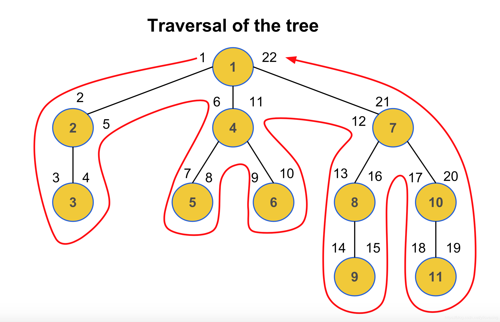

# gorm-mptt

## 预排序遍历树算法(MPTT)树

预排序遍历树算法全称是：Modified Preorder Tree Traversal 简称 MPTT。主要应用于层级关系的存储和遍历。
MPTT在遍历的时候很快，但是其他的操作就会变得很慢。对于需要频繁查询，但修改不是很频繁的树状数据结构， 使用MPTT树进行存储，可以让数据查询更为高效。

一棵标准的树结构：


## 使用方法

1. 定义`model`
    ```go
    type CustomTree struct {
        mptt.ModelBase
        Name     string        `gorm:"type:varchar(125);index:custom_tree_name" validate:"required"`
        Children []*CustomTree `gorm:"-"`
    }
   ```
2. 创建树`manager`。其中gormDb类型为`*gorm.DB`。
    ```go
    manager, err := mptt.NewTreeManager(gormDb, new(CustomTree))
	assert.Nil(t, err)
    ```
   
### 节点增加
1. 使用`CreateNode`方法可以快速创建节点。需要确保`node`的`ParentID`信息正确。如`ParentID`为空，则将插入一棵新的树的根节点。
   ```go
   err := manager.CreateNode(node)
   ```
2. 插入`subNode`，作为`parentNode`的最后一个孩子节点。
    ```go
    err := manager.InsertNode(subNode, parentNode, mptt.LastChild)
    ```
3. 插入`subNode`，作为`parentNode`的第一个孩子节点。
    ```go
    err := manager.InsertNode(subNode, parentNode, mptt.FirstChild)
    ```
4. 插入`newNode`，位置为`existsNode`的左边（前面）
    ```go
    err := manager.InsertNode(newNode, existsNode, mptt.Left)
    ```   
5. 插入`newNode`，位置为`existsNode`的左边（后面）
    ```go
    err := manager.InsertNode(newNode, existsNode, mptt.Right)
    ```

### 节点移动
1. 已知节点主键`ID`，和目标节点的`ID`。使用`MoveNodeByID`方法移动
   ```go
   ok, err := manager.MoveNodeByID(19, 50, mptt.Left) // 将node(19)移动到node(50)的左边
   ok, err := manager.MoveNodeByID(19, 50, mptt.Right) // 将node(19)移动到node(50)的右边
   ok, err := manager.MoveNodeByID(19, 50, mptt.FirstChild) // 将node(19)移动为node(50)的第一个孩子节点
   ok, err := manager.MoveNodeByID(19, 50, mptt.LastChild) // 将node(19)移动为node(50)的最后一个孩子节点
   ```
2. 已知节点和目标节点对象。使用`MoveNode`方法移动。最后一个`refreshTarget`为`true`时，会主动修正`nodeB`对象中的MPTT信息。
   ```go
   ok, err := manager.MoveNode(nodeA, nodeB, mptt.Left) // 将node(19)移动到node(50)的左边
   ok, err := manager.MoveNode(nodeA, nodeB, mptt.Right, true) // 将node(19)移动到node(50)的右边
   ```

### 节点删除
1. 包括按ID删除方法`DeleteNodeByID`，按对象删除方法`DeleteNode`。
   ```go
   err := manager.DeleteNodeByID(19)
   err := manager.DeleteNode(toDeleteNode, true) // 第二个参数代表代表确认node中的MPTT信息准确无误，无需框架主动刷新信息后再执行删除。
   ```

### 节点查询

使用`manager`进行树中信息查询时，需要先使用`Node()`方法锚定某个已知节点(`manager.Node(node).QueryFuncXXX`)。如下：
```go
// 从数据库中重新查询node信息，确保MPTT信息准确，有部分方法，如IsRootNode，不会实际查库，
// 主要根据MPTT信息计算的到结果。所以当不确认node信息是否准确时，建议RefreshNode
err := manager.RefreshNode(node)

// 查询node节点是否为根节点
isRoot := manager.Node(node).IsRootNode()

// 查询node节点是否为叶子节点
isLeaf := manager.Node(node).IsLeafNode()

// 查询node节点是否为子节点
isChild := manager.Node(node).IsChildNode()

// 查询node节点的level
level := manager.Node(node).GetLevel()

// 查询node节点所在树的根节点
err = manager.Node(node).GetRoot(&result)

// 查询node节点下级的所有叶子节点
err = manager.Node(node).GetLeafNodes(&results)

// 查询node节点的所有子节点
err = manager.Node(node).GetChildren(&results)

// 查询node节点的所有兄弟节点（parentID相同的节点）
err = manager.Node(node).GetSiblings(&results)

// 查询node节点的所有子孙节点， includeSelf为真时，列表包含当前节点
err = manager.Node(node).GetDescendants(&results)
err = manager.Node(node).GetDescendants(&results, includeSelf)

// 查询node节点的所有祖先节点， includeSelf为真时，列表包含当前节点。该方法返回的数据默认从根节点到当前node排序。
err = manager.Node(node).GetAncestors(&results)
err = manager.Node(node).GetAncestors(&results, includeSelf)

// 查询Family节点列表，包含祖先节点和子孙节点
err = manager.Node(node).GetFamily(&results)

// 查询node的下一个兄弟节点，可以传入conditions(gorm过滤器)，用于过滤符合条件的右侧兄弟
err = manager.Node(node).GetNextSibling(&result, conditions...)

// 查询node的前一个兄弟节点，可以传入conditions(gorm过滤器)，用于过滤符合条件的左侧兄弟
err = manager.Node(node).GetPreviousSibling(&result, conditions...)

// 查询node节点是否为target节点的祖先节点。includeSelf == true时，node == target也为真
isAncestor := manager.Node(node).IsAncestorOf(target, includeSelf)

// 查询node节点是否为target节点的子孙节点。includeSelf == true时，node == target也为真
IsDescendant := manager.Node(node).IsDescendantOf(target, includeSelf)
```


### Rebuild方法

使用场景：
1. 当有节点不是通过`TreeManager`中的方法创建，需要修正树中节点的MPTT信息；
2. 当并发处理导致树上的MPTT信息错乱时；
3. 其他任何导致树上MPTT信息不准确，需要修正这些数据时

都可以调用`Rebuild`来修正整个森林，`PartialRebuild`修正特定的树：
```go
err = manager.Rebuild()
err = manager.PartialRebuild(treeID)
```

### 备注

设计上，为了保证已有的树结构，可以使用本库快速迁移到MPTT，`ID`、`ParentID`列支持除了数值和`string`类型，但当前只测试了内嵌`mptt.ModelBase`的`int`类型场景。
`left`、`right`、`level`、`tree_id`等业务无关列强制要求使用`int`类型。

TODO: 测试`string`类型主键。
```go
manager, err := mptt.NewTreeManager(gormDb, new(CustomTree), mptt.WithAttrs(colFields))
```